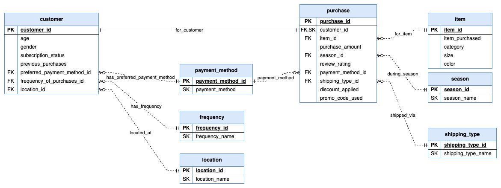

# 608_HW3_ERModels
HW3 for CMSC 608

## ER Models
The requirements for this assignment are as follows:

- Identify all Entities, attributes and their relationships from the given data.
- Extract all the relevant Entities, attributes and their relationships from the excel file to prepare the dataset that can be used in creating all the necessary Database Tables.
- Identify all the primary Keys, Foreign Keys, Composite Keys if any from your  ER Model.
- Use the Crow's foot Notation to draw the ER Model diagram indicating all the participants, cardinalities, and connectivity.

The data for this is found in the file [shopping_trends.csv](shopping_trends.csv).

### File Description
The CSV file contains the following columns:
- Customer ID
- Age
- Gender
- Item Purchased
- Category
- Purchase Amount (USD)
- Location
- Size
- Color
- Season
- Review Rating
- Subscription Status
- Payment Method
- Shipping Type
- Discount Applied
- Promo Code Used
- Previous Purchases
- Preferred Payment Method
- Frequency of Purchases

This describes a customer purchasing an item. Generally, purchases would be independent of customers, but since each row identifies a unique customer ID, we can presume that each row represent a single unique customer, along with a single unique purchase. This is unusual, as customers would typically make multiple purchases. However, the unique customer ID tells us that each customer is unique.

The Items purchased shows data that is not unique. There are only 25 types of items, with variations in size and color. These represent a single entity, with the size and color being attributes of the item. The category is also an attribute of the item.

While a customer and a purchase are each unique, they potentially represent a one-to-many relationship, with customers making multiple purchases. This is not represented in the data, but is a common assumption in retail. There is an indication that customers have made previous purchases, which further implies a one-to-many relationship between customers and purchases. Consequently, the these entities are being kept separate, despite having an apparent one-to-one relationship.

Many fields have repeated information:
- Gender
- Categoty
- Location
- Size
- Color
- Season
- Review Rating
- Subscription Status
- Payment Method
- Shipping Type
- Discount Applied
- Promo Code Used
- Previous Purchases
- Preferred Payment Method
- Frequency of Purchases

Some of these should be represented as enumerated types, such as `Male` and `Female` for "Gender", or `Yes` and `No` for "Subscription Status", "Discount Applied" and "Promo Code Used".

The other fields might be normalized into separate entities, but without any further information about each one, this is difficult to justify. The one exception is "Payment Method" and "Preferred Payment Method", which both refer to the same limited set of values. These can be normalized into a separate entity.

### Entities
The entities and their fields are:
* Customer
  - id (Primary Key)
  - age
  - gender
  - subscriptionStatus
  - previousPurchases
  - preferredPaymentMethod (Foreign Key)
  - frequencyOfPurchases
  - location
* Item
  - id (Primary Key)
  - itemPurchased
  - category
  - size
  - color
* Purchase
  - customerId (Primary Key, Foreign Key)
  - itemId (Foreign Key)
  - purchaseAmount
  - season
  - reviewRating
  - paymentMethod (Foreign Key)
  - shippingType
  - discountApplied
  - promoCodeUsed
* PaymentMethod
  - id
  - paymentMethod

### Relationships
The relationships between the entities are:
* Customer to Purchase: One-to-One (Note: this is unexpected, as customers typically make multiple purchases)
* Item to Purchase: One-to-Many
* PaymentMethod to Customer: One-to-Many
* PaymentMethod to Purchase: One-to-Many

## Data
Each of these entities have been extracted from the [shopping_trends.csv](shopping_trends.csv) file and placed into separate CSV files:
* [customer.csv](customer.csv)
* [item.csv](item.csv)
* [purchase.csv](purchase.csv)
* [payment-method.csv](payment-method.csv)

These were created with the help of a [Babaska Script](extract.bb). While simple shell scripts could extract the basic information, mapping records to the appropriate foreign keys needed lookup operations are are easier in programming languages like [Babashka](https://github.com/babashka/babashka) or Python.

## ER Diagram

The ER Diagram is shown below:

This diagram shows the entities with their fields, the relationships between the entities, as well as the cardinality and identifying or non-identifying attributes of each relationship. The diagram was created using [draw.io](https://app.diagrams.net/).

## License
This project is licensed under the Create Commons CC0 1.0 Universal License - see the [LICENSE](LICENSE) file for details.
